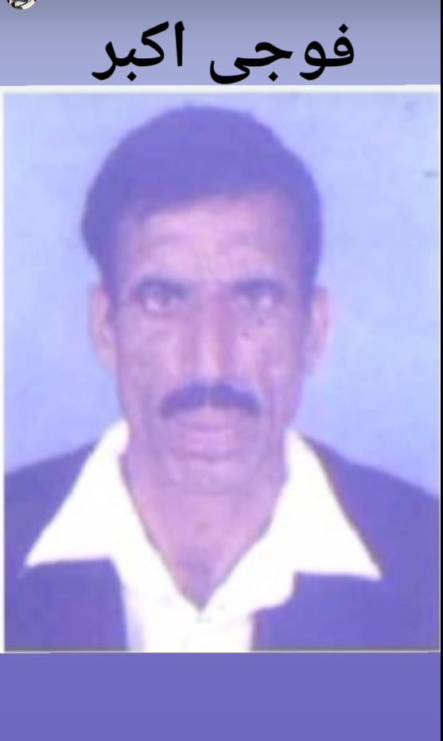

<!DOCTYPE html>
<html lang="en">
<head>
    <meta charset="UTF-8">
    <meta name="viewport" content="width=device-width, initial-scale=1.0">
    <title>PAKARMY FOJI AKBAR WARRAICH LANGAY GUJRAT</title>
    <meta name="description" content="Langay, Langay Khojy - PAKARMY FOJI AKBAR WARRAICH">
    <meta name="keywords" content="Langay, Langay Khojy, PAKARMY, FOJI, AKBAR, WARRAICH, Gujrat">
    <meta name="robots" content="index, follow">
    
</head>
<body>
    <h1>PAKARMY FOJI AKBAR WARRAICH LANGAY GUJRAT</h1>
    
PAK ARMY

    
</body>
</html>

